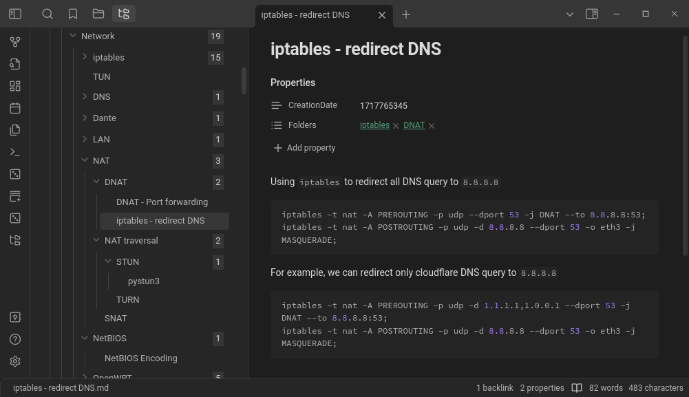
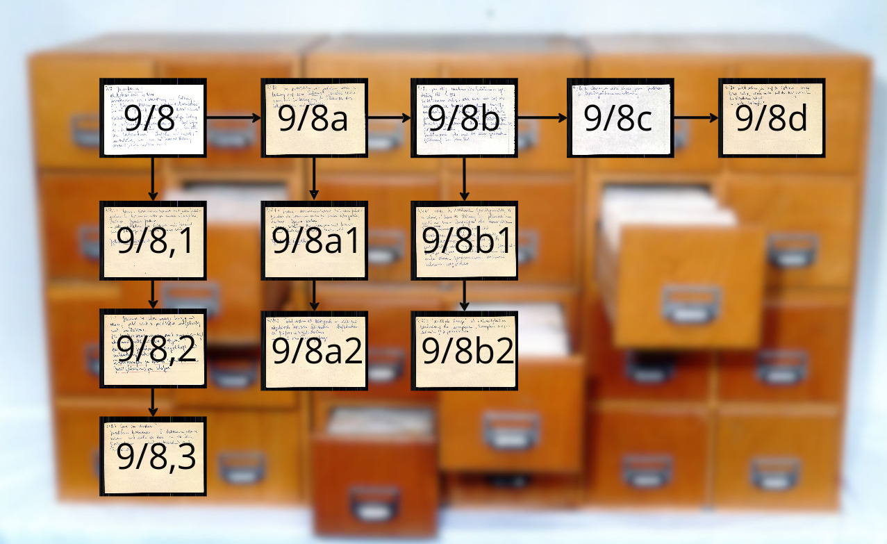
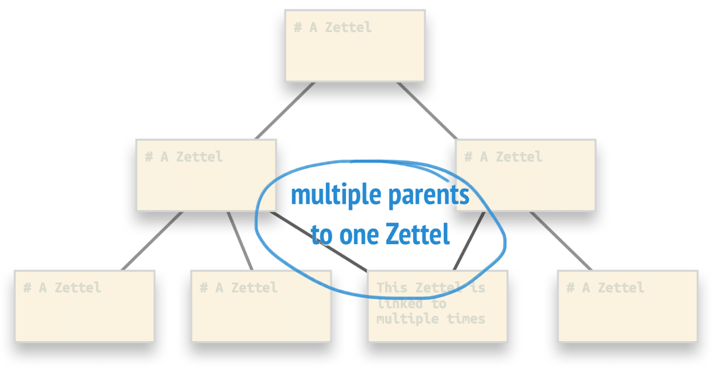
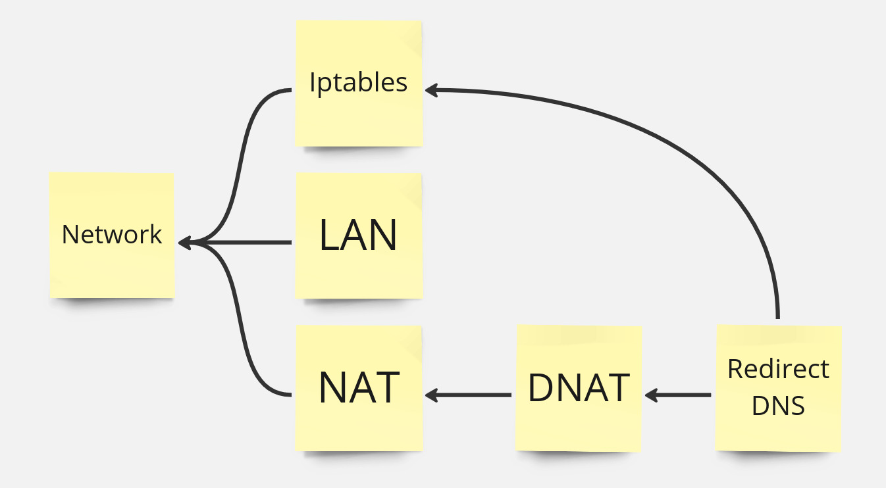
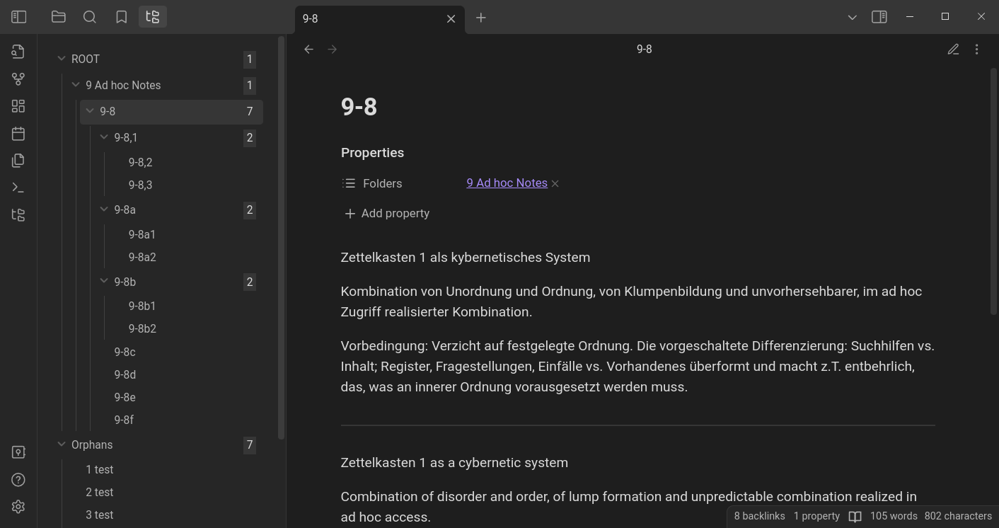
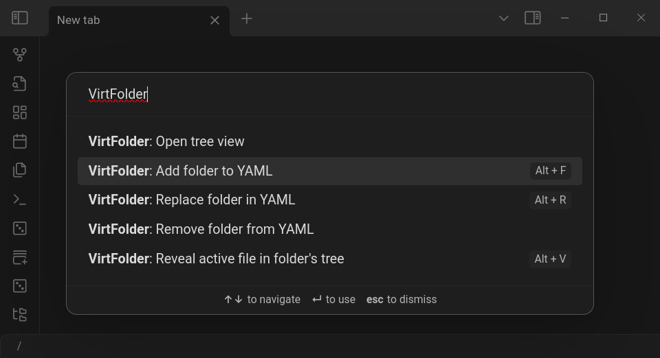

# VirtFolder plugin

Плагин для создания иерархической структуры в Obsidian.

Позволяет быстро находить заметки, перемещаясь по базе как по оглавлению книги.



> https://github.com/gr0grig/obsidian-virt-folder/

## Иерархия как в архиве Лумана



Что может быть представлено как вложенный список:

```
- 9/8
	- 9/8a
		- 9/8a1
		- 9/8a2
	- 9/8b
		- 9/8b1
```

## Структура VirtFolder

VirtFolder повторяет эту структуру, используя аналогию компьютерной файловой системы. Любая карточка может выступать в роли "виртуальной папки". Отношения между карточками прописываются в YAML. В поле `Folders` содержится список ссылок на все папки, в которые вложена карточка.

## Ключевая особенность - multiple parrents

Карточка может принадлежать нескольким папкам одновременно, это буквальный аналог symlink. 



Пример показан на первом снимке, карточка вложена в папки `DNAT` и `iptables`.



## Tree View

При вызове плагина, слева отображается Tree View, включающий все папки и файлы.

Так мог бы выглядеть архив Лумана в Obsidian. 



Папки имеющие детей, но не имеющие родителей считаются корневыми и помещаются в `Root`. Файлы у которых нет родителя складываются в `Orphans` чтобы их легче было найти.

### Управление 

- click - раскрывает ветку и открывает файл в текущей вкладке
- click+shift - открывает файл в текущей вкладке, но не раскрывает ветку
- click+ctrl - открывает файл в новой вкладке

## Горячие клавиши

Горячие клавиши назначаются в настройках на команды: 



- Открыть окно с TreeView
- Добавить папку в YAML
- Заменить папку
- Удалить папку
- Отобразить открытый файл на древе

Многократный вызов `ALT+V` отобразит по очереди все "копии" файла.

## Аналоги

https://github.com/levirs565/obsidian-dendron-tree

