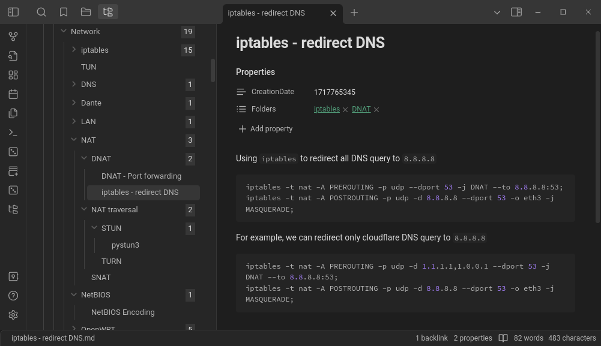

# VirtFolder plugin
A plugin for creating a hierarchical structure in Obsidian.

Allows you to quickly find notes by navigating the knowledge base like a book table of contents.

## Articles

- [How to organize a knowledge base in Obsidian using the Luhmann method](https://medium.com/@mr.grogrig/how-to-organize-a-knowledge-base-in-obsidian-using-the-luhmann-method-e6768c29b18f) (en)
- [VirtFolder — Obsidian plugin overview](https://habr.com/ru/articles/1000502/) (en)
- [VirtFolder — обзор плагина для Obsidian](https://habr.com/ru/articles/1000254/) (ru)

## Features

- The ability to perform all operations using hot keys
- Dragging and dropping notes with the mouse
- Creating and deleting notes via the right-click menu
- Add files to virtual folders from the file explorer context menu
- Emoji icon picker with categorized groups for notes
- Tag-based note highlighting with configurable colors
- Frontmatter as HTML data attributes for CSS styling
- Optional string format for single-parent folder links
- Create notes via Unique note creator
- Front Matter Title plugin support
- Database optimization

## Documentation

The current documentation is available in the [docs](./docs/index.md) folder.

The old documentation is located on [GitBook](https://virtfolder.gitbook.io/index).

## Example

https://github.com/user-attachments/assets/a4990b31-c8ea-48c8-815a-98521d81fc7d